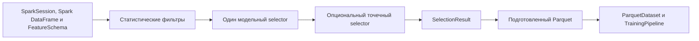

# Feature Selection в Sber-AmazMe-FMLib

## Статус документа

Предложение архитектуры нового модуля. Алгоритмы отбора находятся на этапе ранней разработки, поэтому документ фиксирует
границы модуля, контракты и требования к воспроизводимости, но не фиксирует внутреннюю реализацию отдельных алгоритмов.

Последовательность переноса кода и проверки совместимости описана в
[процессе интеграции](feature_selection_integration.md).

## Контекст

Подготовка признаков для FM-моделей выполняется на CPU до запуска обучения. Объём исходных данных может не позволять
загрузить их в память одной машины, поэтому входным и основным вычислительным движком является Spark. Часть библиотек
отбора признаков эффективнее или доступна только для локальных DataFrame, в которые pipeline при необходимости
самостоятельно преобразует ограниченный объём данных.

Новый модуль должен объединить статистические и модельные методы отбора в настраиваемый пайплайн, который запускается
исследователем из Jupyter Notebook. Модуль не входит в `TrainingPipeline`: результат его работы применяется при подготовке
Parquet-датасетов и конфигурации последующего обучения.

## Цели

- предоставить единый пайплайн из статистического, модельного и опционального точечного этапов;
- принимать активную Spark-сессию и один или несколько Spark DataFrame без изменения исходных объектов;
- использовать Spark там, где распределённое выполнение поддерживается алгоритмом и даёт преимущество;
- автоматически и безопасно выполнять внутренний переход к pandas или polars для алгоритмов без подходящей Spark-реализации;
- принимать описание категориальных и непрерывных признаков;
- возвращать списки оставленных и исключённых признаков с причинами решения;
- поддерживать настройку через Python-объекты и сериализуемый конфиг;
- обеспечивать воспроизводимость результата и возможность применить его к train, validation и inference данным.

## Место в архитектуре fmlib

Модуль предлагается разместить в отдельном namespace `fmlib.feature_selection`. Он не должен располагаться в
`fmlib.data.utils.selection`, где `RaritySelector` решает другую задачу — выбор строк по редкости, — или в
`fmlib.nn.transforms`, предназначенном для побатчевых преобразований тензоров.



Предлагаемая структура пакета:

```text
fmlib/feature_selection/
├── pipeline.py             # фасад FeatureSelectionPipeline
├── config.py               # типизированная конфигурация
├── schema.py               # FeatureSchema и валидация входа
├── result.py               # SelectionResult и сериализация
├── backends/               # Spark и внутренние pandas/polars adapters
├── statistical_filters/    # null, constant, correlation, PSI, stability
├── model_based/            # Lasso, RF, CatBoost RFE, LGBM
└── precise/                # BorutaShap
```

Структура является целевой декомпозицией, а не требованием создать пустые модули до появления реализаций.

## Входные данные

### Spark-сессия и DataFrame

Публичный фасад всегда принимает активный `pyspark.sql.SparkSession`. Данные передаются одним из двух способов:

- один `pyspark.sql.DataFrame`, в котором опциональная колонка `FeatureSchema.split` содержит значения `train`, `valid`
  и `test`;
- mapping отдельных `pyspark.sql.DataFrame` с явно заданными ключами `train`, `valid` и `test`.

Train DataFrame обязателен, valid и test опциональны. Нельзя одновременно передать единый DataFrame и mapping. Все
переданные DataFrame должны принадлежать совместимой Spark-сессии и иметь совместимые схемы признаков.

Пользователь не преобразует данные в pandas или polars перед вызовом. Pipeline делает это самостоятельно, если выбранный
алгоритм требует локальный backend. Такое автоматическое преобразование остаётся контролируемым: до `toPandas()`,
`collect()` или эквивалентной операции pipeline проецирует нужные колонки, применяет sampling и проверяет лимиты строк и
памяти. Переход показывается в execution plan и сохраняется в результате. При превышении лимита pipeline завершается
диагностической ошибкой, а не пытается выгрузить весь датасет на driver.

### FeatureSchema

Описание признаков отделено от физической схемы DataFrame:

```python
schema = FeatureSchema(
    categorical=["segment", "region"],
    continuous=["age", "balance", "activity"],
    target="response",
    task_type="binary_classification",
    time="event_date",
    split="dataset_split",  # опционально для единого DataFrame
    fold=None,
    id_columns=["client_id"],
)
```

Обязательны:

- непересекающиеся списки `categorical` и `continuous`;
- `target` для модельного и финального этапов;
- `task_type`: `binary_classification`, `classification` или `regression`; `classification` означает многоклассовую задачу;
- наличие всех объявленных колонок в DataFrame.

Опциональны:

- `time` для month-over-month PSI и time-based CV;
- `split` с метками `train`, `valid` и `test` для OOS-оценки, train-valid PSI и корректного sampling;
- `fold` для заранее рассчитанного CV-разбиения внутри train-части;
- `id_columns` и другие служебные колонки, которые не участвуют в отборе, но могут быть нужны для разбиения и аудита.

`split` не заменяет `fold`: первая колонка отделяет train от OOS-частей датасета, вторая задаёт внутренние folds для оценки
модели только на train. Обе колонки опциональны, исключаются из кандидатов и сохраняются при применении результата.
Если выборки переданы отдельными DataFrame, `split` не требуется: pipeline использует типы из ключей mapping. Если `fold`
не задан, CV-разбиение строится согласно конфигурации.

Перед вычислениями pipeline проверяет дубликаты, пересечения групп, отсутствующие колонки, допустимость типов и наличие
необходимых служебных полей. Категориальные признаки не должны автоматически приводиться к числам без явно выбранной
стратегии кодирования.

## Этапы пайплайна

Каждый этап получает текущий список кандидатов и возвращает решения по признакам. Исключённый признак не передаётся на
следующий этап. Для каждого решения сохраняются этап, метод, причина, порог и вычисленные значения.

### 1. Дешёвые статистики

Проверки выполняются последовательно и могут независимо включаться в конфиге:

1. **Null rate** — исключение признаков, у которых доля пропусков выше заданного порога.
2. **Constants** — исключение константных и квазиконстантных признаков. Конфиг задаёт минимальное число уникальных значений
   и/или максимальную долю наиболее частого значения.
3. **Correlation** — исключение одного из сильно коррелирующих непрерывных признаков. Конфиг обязан задавать метод,
   порог и детерминированное правило выбора признака из пары. По умолчанию сохраняется признак с меньшей долей пропусков,
   затем с более устойчивым PSI, затем первый по исходному порядку.
4. **PSI** — опциональное исключение нестабильных признаков в одном из двух режимов сравнения:
   - `month_over_month` сравнивает соседние месяцы по `FeatureSchema.time`;
   - `train_valid` сравнивает train и valid из `FeatureSchema.split` или mapping отдельных DataFrame.
   Конфиг задаёт режим, способ формирования корзин, число корзин, обработку пропусков, агрегацию результатов и порог.
5. **Stability classifier** — опциональная проверка каждого признака моделью, предсказывающей источник наблюдения
   (`train`, `valid` или `test`) только по значениям этого признака. Высокое качество классификации означает, что признак
   различает выборки и может быть исключён как нестабильный.

Spark является предпочтительным backend для агрегаций по большим данным. Реализация не должна выполнять отдельный полный
проход по данным для каждого признака, если статистики можно объединить в один план выполнения.

Для correlation первая версия может поддерживать только непрерывные признаки. Метрики связи категориальных признаков
должны добавляться отдельными методами, а не маскироваться под Pearson correlation.

В режиме month-over-month pipeline проверяет непрерывность периодов и минимальное число наблюдений, вычисляет PSI для
каждой соседней пары месяцев и применяет настроенную агрегацию, например максимум или среднее. В режиме train-valid
test не участвует в расчёте порога. Источник выборки определяется по `split` или ключам mapping. Если PSI отключён,
проверки его входов не выполняются и pipeline продолжает работу. Если PSI включён, но для выбранного режима отсутствуют
`time` или пары train/valid, pipeline завершается ошибкой конфигурации.

Stability classifier также по умолчанию отключён. Для двух выборок это бинарная, для трёх — многоклассовая классификация.
Pipeline балансирует выборки согласно конфигу, оценивает качество по CV и сравнивает агрегированную метрику с порогом.
Модель обучается отдельно для каждого признака, чтобы решение оставалось интерпретируемым. Колонка источника формируется
из `split` или ключей mapping и не передаётся модели как признак.

### 2. Модельный отбор

На одном запуске выбирается ровно один метод:

- Lasso;
- Random Forest;
- CatBoost RFE;
- LightGBM.

Общий контракт метода включает обучение, расчёт importance или ранга и применение правила отбора. Конкретная модель
самостоятельно определяет допустимую обработку категориальных признаков, но итоговые scores приводятся к общему формату.

Optuna и Cross Validation являются настройками модельного этапа:

- Optuna может быть отключена или ограничена числом trials, timeout и доступным параллелизмом;
- CV задаётся числом folds или внешней колонкой `FeatureSchema.fold`;
- поддерживаются random, stratified, group и time-based стратегии, если для них заданы необходимые колонки;
- metric, направление оптимизации и seed указываются явно;
- preprocessing обучается внутри каждого fold, чтобы не допустить утечку из validation;
- итоговый отбор использует агрегированные по folds scores и явно заданное правило стабильности.

Выбор backend зависит от метода и доступной реализации. Наличие Spark DataFrame на входе не означает, что локальная
библиотека модели автоматически становится распределённой.

### 3. Финальный отбор

Этап опционален и имеет только одно из значений:

- `boruta_shap`;
- `none` (`None` в Python или `null` в YAML).

Точечный метод работает только с кандидатами, прошедшими предыдущие этапы. Он использует тот же CV/split contract либо
явно выделенную holdout-выборку. Результат содержит исходные importance, агрегированные scores и принятое решение.

`none` является полноценным вариантом конфигурации и завершает pipeline результатом модельного этапа.

## Backend-стратегия

Поддержка нескольких DataFrame не означает реализацию всех алгоритмов поверх искусственного наименьшего общего API.
Каждый метод объявляет поддерживаемые backends и требования к данным.

| Операция | Предпочтительный backend | Допустимый fallback |
|---|---|---|
| Null, constants, PSI, stability classifier | Spark для больших данных | pandas или polars |
| Correlation | Spark для широких распределённых данных | pandas или polars |
| Lasso, Random Forest | Реализация определяется конфигом | Локальный pandas/polars dataset |
| CatBoost RFE | Локальная CPU-реализация | Нет неявного Spark fallback |
| LightGBM | Доступная CPU/Spark-реализация | Локальный dataset |
| BorutaShap | Локальная CPU-реализация | Контролируемое преобразование из Spark |

Перед локальным этапом pipeline строит план перехода:

1. проецирует только оставшиеся признаки, target и служебные колонки;
2. при необходимости применяет детерминированную выборку;
3. оценивает или получает лимит числа строк и ожидаемый объём;
4. проверяет `max_local_rows` и `local_memory_limit` в GB (`4` означает лимит 4 GB);
5. выполняет материализацию только после успешной проверки;
6. записывает способ и параметры перехода в `SelectionResult`.

Если данные превышают лимит и подходящего backend нет, pipeline завершает этап диагностической ошибкой с рекомендацией
изменить sampling или selector. Автоматический полный `collect()` запрещён.

Пользователь может запретить переходы полностью:

```yaml
execution:
  allow_local_fallback: false
```

## Публичный API

Основной API ориентирован на последовательный запуск в notebook. Вариант с единым DataFrame:

```python
from fmlib.feature_selection import FeatureSchema, FeatureSelectionConfig, FeatureSelectionPipeline

config = FeatureSelectionConfig.from_yaml("feature_selection.yaml")
pipeline = FeatureSelectionPipeline(config)

result = pipeline.fit_select(
    spark=spark,
    data=train_df,
    schema=FeatureSchema(
        categorical=["segment", "region"],
        continuous=["age", "balance", "activity"],
        target="response",
        task_type="binary_classification",
        time="event_date",
        split="dataset_split",
        id_columns=["client_id"],
    ),
)

result.selected_features
result.dropped_features
result.save("artifacts/feature_selection.json")
```

Эквивалентный вариант с отдельными Spark DataFrame:

```python
result = pipeline.fit_select(
    spark=spark,
    datasets={
        "train": train_df,
        "valid": valid_df,
        "test": test_df,
    },
    schema=FeatureSchema(
        categorical=["segment", "region"],
        continuous=["age", "balance", "activity"],
        target="response",
        task_type="binary_classification",
        fold=None,
        id_columns=["client_id"],
    ),
)
```

`fit_select` не изменяет входные DataFrame. Отдельный метод `result.apply(data)` или `pipeline.transform(data, result)`
возвращает проекцию Spark DataFrame, сохраняя служебные колонки.

Конфигурация также может создаваться напрямую типизированными Python-объектами. YAML не зависит от Hydra, чтобы pipeline
можно было использовать самостоятельно; Hydra может инстанцировать те же объекты как дополнительный способ интеграции.

Пример конфигурации:

```yaml
statistics:
  null_rate:
    enabled: true
    threshold: 0.95
  constants:
    enabled: true
    max_frequency: 0.999
  correlation:
    enabled: true
    method: pearson
    threshold: 0.9
  psi:
    enabled: false
    mode: train_valid
    threshold: 0.25
    bins: 10
model:
  method: catboost_rfe
  params: {}
  selection:
    max_features: 100
  tuning:
    enabled: true
    n_trials: 30
    timeout_seconds: 3600
  cross_validation:
    strategy: stratified
    folds: 5
    metric: roc_auc

precise:
  method: boruta_shap

execution:
  seed: 42
  allow_local_fallback: true
  max_local_rows: 1000000
  local_memory_limit: 4  # GB
  local_sample:
    strategy: stratified
    cache_intermediate: true
```

Конфиг валидируется до запуска Spark actions или обучения моделей. Неизвестные поля и несовместимые сочетания настроек
считаются ошибкой.

## Результат и артефакт

`SelectionResult` содержит:

- упорядоченные `selected_features`;
- `dropped_features` с этапом, методом, причиной и измеренным значением;
- scores, ranks и importances для обработанных признаков;
- входную `FeatureSchema`, включая вид задачи и служебные колонки split/fold;
- нормализованный конфиг;
- идентификатор Spark-сессии, способ передачи выборок и backend каждого этапа;
- сведения о sampling и переходах между движками;
- seed, версии fmlib и алгоритмических зависимостей;
- времена выполнения и статус этапов;
- fingerprint входной схемы и, при наличии, идентификатор версии датасета;
- warnings, в том числе об ограниченной сопоставимости scores.

Минимальный сериализованный формат:

```json
{
  "format_version": 1,
  "selected_features": ["age", "activity"],
  "dropped_features": [
    {
      "feature": "balance",
      "stage": "statistics",
      "method": "psi",
      "reason": "threshold_exceeded",
      "value": 0.31,
      "threshold": 0.25
    }
  ]
}
```

JSON является каноническим форматом обмена. YAML может поддерживаться для удобства чтения. Добавление полей допускается
в пределах текущей `format_version`; несовместимое изменение требует новой версии и мигратора.

При применении артефакта pipeline проверяет наличие выбранных признаков и совместимость их типов. Неизвестные дополнительные
колонки разрешены, а отсутствующие выбранные признаки по умолчанию являются ошибкой.

## Воспроизводимость и защита от утечек

- все источники случайности получают один корневой seed и производные seeds этапов;
- разбиение train/validation формируется до обучения preprocessing и selector;
- target, time, split, fold, id и служебные колонки никогда не попадают в список кандидатов;
- fitted bins PSI и правила кодирования сохраняются в диагностике результата;
- порядок признаков детерминирован и не зависит от порядка завершения Spark tasks или Optuna trials;
- повторный запуск с теми же версиями, конфигом и данными должен давать те же selected/dropped списки;
- точное совпадение floating-point scores между backends не является гарантией.

Для time-dependent данных random CV не должен использоваться по умолчанию. Pipeline выдаёт предупреждение или ошибку
согласно выбранной strictness-настройке.

## Работа в Jupyter

Длительные операции должны показывать прогресс на уровне этапов и trials без вывода отдельных строк данных. Pipeline
предоставляет структурированные события или callback, поверх которого notebook может построить progress bar.

Повторный запуск после сбоя может использовать сохранённый checkpoint завершённого этапа, только если совпадают fingerprint
схемы, конфиг этапа и версия формата. Spark cache/persist освобождается после завершения или отмены pipeline.

Notebook-пример должен:

- показывать создание схемы и конфига;
- выполнять dry-run плана backend-переходов;
- запускать pipeline и анализировать причины исключения;
- сохранять и повторно применять артефакт;
- не содержать outputs при коммите.

## Ошибки и диагностика

Ошибки разделяются на:

- schema errors — отсутствующие, пересекающиеся или неподдерживаемые колонки;
- config errors — несовместимые этапы, CV или метрики;
- capacity errors — превышение лимитов локальной материализации;
- backend errors — отсутствие optional dependency или реализации;
- execution errors — сбой Spark job, Optuna trial или обучения.

Сообщение должно содержать этап, backend и исправимое действие. Ошибки отдельных Optuna trials могут быть отражены в
диагностике и не обязаны завершать весь запуск, пока остаётся достаточное число успешных trials.

## Зависимости

Тяжёлые и backend-specific библиотеки не должны становиться обязательными зависимостями training-only установки fmlib.
Предлагаются optional dependency groups для:

- Spark: PySpark;
- Polars: Polars для внутренних локальных преобразований;
- model selection: CatBoost, LightGBM и Optuna;
- precise selection: SHAP и реализация BorutaShap.

pandas и scikit-learn уже являются зависимостями проекта. Импорт optional dependency выполняется только при выборе
соответствующего backend или метода и завершается сообщением с названием требуемой группы установки.

Точный состав и совместимость версий должны быть проверены во внутреннем package mirror до изменения `pyproject.toml`.

## Тестирование

### Unit tests

- валидация `FeatureSchema` и конфигурации;
- пороговые и граничные случаи каждого фильтра, включая отключённые PSI и stability classifier;
- детерминированное разрешение коррелирующих пар;
- сериализация и обратная загрузка `SelectionResult`;
- отсутствие target и служебных колонок среди кандидатов;
- контроль лимитов локальной материализации.

### Contract tests

На малых фиксированных наборах проверяются одинаковые selected/dropped решения для всех поддерживаемых backend. Допускается
заданный tolerance для scores. Если алгоритмы backends имеют различную семантику, различие фиксируется в документации и
отдельном contract.

### Integration tests

- полный pipeline с одним методом каждого этапа;
- Spark local mode без внешнего кластера и оба способа передачи выборок;
- переход Spark → local с projection, sampling и проверкой лимитов;
- CV без утечки preprocessing;
- сохранение результата и применение к train/validation/inference;
- восстановление после checkpoint.

Тесты располагаются рядом с реализацией в каталогах `tests`. Тяжёлые тесты должны иметь отдельный marker и не препятствовать
проверке core fmlib без optional dependencies.

## Интеграция с обучением

Selection artifact является границей между новым модулем и существующим fmlib:

1. pipeline возвращает выбранные признаки;
2. ETL проецирует их и сохраняет подготовленный Parquet;
3. автор эксперимента синхронизирует `Metadata` и размерности модели в Hydra-конфиге;
4. одинаковый artifact применяется к validation и inference данным;
5. `ParquetDataset` и `TrainingPipeline` работают без зависимости от feature-selection backends.

Автоматическая генерация patch для `Metadata` может быть добавлена позже отдельной интеграцией. Она не должна быть скрытым
side effect `fit_select`.

## Поэтапное внедрение

1. Публичные contracts, конфигурация, валидация, result artifact и notebook skeleton.
2. Статистические фильтры и Spark/pandas contract tests.
3. Один модельный selector, CV и Optuna, затем остальные модельные методы.
4. BorutaShap selector.
5. Polars backend и расширение backend parity.
6. Интеграционный notebook и документация по подготовке Parquet/Hydra metadata.

Каждый этап должен оставлять работоспособный pipeline: ещё не реализованные методы отклоняются при валидации с явным
сообщением, а не переключаются на другой алгоритм.

Подробные действия, dependency groups, проверки и checklist приведены в
[процессе интеграции модуля в fmlib](feature_selection_integration.md).

## Риски и меры

| Риск | Мера |
|---|---|
| Driver OOM при Spark → local | Явные row/byte limits, projection, sampling и запрет скрытого `collect()` |
| Разная семантика backend | Capability registry и contract tests |
| Утечка target или validation | Типизированная схема и preprocessing внутри folds |
| Невоспроизводимый Optuna/CV | Seed, сохранение normalized config и версий |
| Рост времени на широких данных | Объединение агрегаций, последовательное сокращение признаков, checkpoints |
| Конфликт optional dependencies | Изолированные группы и ленивые импорты |
| Нестабильность ранних алгоритмов | Стабильный внешний контракт и версионируемый artifact |

## Критерии готовности к слиянию

- публичные классы имеют docstrings с аргументами и возвращаемыми значениями;
- core fmlib импортируется без Spark, Polars, CatBoost, LightGBM, Optuna и SHAP;
- нет неявного полного Spark `collect()`;
- каждый реализованный метод объявляет capabilities и ограничения backend;
- selected/dropped решения содержат объяснимую причину;
- артефакт сохраняется, загружается и повторно применяется;
- unit и contract tests проходят без внешнего Spark-кластера;
- notebook очищен от outputs;
- задокументирована синхронизация результата с Parquet, metadata и размерностями модели.
