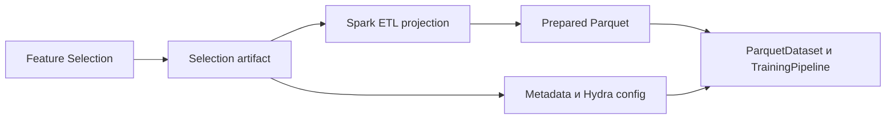

# Интеграция модуля Feature Selection в Sber-AmazMe-FMLib

## Назначение

Документ описывает технический процесс переноса самостоятельного модуля Feature Selection в репозиторий fmlib.
Целевая архитектура, публичные контракты и алгоритмы описаны в
[design doc](feature_selection.md). Здесь зафиксированы последовательность интеграции, требования к каждому этапу и
критерии безопасного слияния.

Интеграция должна сохранить возможность устанавливать и использовать основную часть fmlib без Spark, Polars, CatBoost,
LightGBM, Optuna и SHAP. Для запуска Feature Selection всегда требуются активная Spark-сессия и Spark DataFrame; pandas
и polars используются только как внутренние backends отдельных этапов.

## Предварительный аудит

До переноса кода необходимо зафиксировать состояние исходного модуля:

- поддерживаемые версии Python и сторонних библиотек;
- ограничения Spark DataFrame и внутренних локальных backends каждого алгоритма;
- публичные классы, функции и конфиги, используемые в notebook;
- форматы промежуточных и итоговых артефактов;
- глобальное состояние, переменные окружения и side effects;
- способы логирования и отображения прогресса;
- тестовые данные и ожидаемые результаты;
- лицензии прямых и транзитивных зависимостей;
- доступность пакетов во внутреннем package mirror.

Результатом аудита должна быть таблица соответствия исходного API целевым контрактам fmlib. Несовместимости устраняются
через адаптер или явно оформленное изменение API, но не через дублирование двух публичных интерфейсов.

## Целевая граница пакета

Код переносится в отдельный namespace:

```text
fmlib/feature_selection/
├── __init__.py
├── pipeline.py
├── config.py
├── schema.py
├── result.py
├── backends/
├── statistics/
├── model_based/
├── precise/
└── tests/
```

В `fmlib.feature_selection.__init__` экспортируется только стабильный notebook API:

- `FeatureSelectionPipeline`;
- `FeatureSelectionConfig`;
- `FeatureSchema`;
- `SelectionResult`.

Внутренние selectors и backend adapters не становятся частью публичного API без отдельного решения. Модуль не импортируется
из корневого `fmlib.__init__`, если это приводит к загрузке optional dependencies.

## Последовательность интеграции

### 1. Зафиксировать контракты

До переноса алгоритмов добавляются:

- типизированный `FeatureSchema`;
- типизированный и валидируемый `FeatureSelectionConfig`;
- `SelectionResult` с версией формата;
- интерфейс этапа отбора;
- capability contract backend;
- исключения schema, config, capacity, backend и execution уровней.

Контракты покрываются unit-тестами. На этом этапе допустим pipeline с тестовыми selectors, но публичные методы уже должны
иметь окончательные сигнатуры или документированный migration path.

`FeatureSchema.split` и `FeatureSchema.fold` опциональны и имеют разную семантику:

- `split` содержит метку набора (`train`, `valid`, `test`) и применяется для OOS-оценки, PSI и корректного sampling;
- `fold` содержит номер или имя CV-fold внутри train-части.

Ни одна из этих колонок не участвует в отборе как признак.

Контракт входа поддерживает две взаимоисключающие формы:

- один Spark DataFrame и заполненный `FeatureSchema.split`;
- mapping отдельных Spark DataFrame с ключами `train`, `valid`, `test`.

Train обязателен, valid и test опциональны. Во втором варианте `FeatureSchema.split` не требуется. Если `fold` отсутствует,
pipeline строит CV-folds по конфигурации. В обоих вариантах публичный метод отдельно принимает активный `SparkSession`.

### 2. Перенести конфигурацию

Исходные словари и notebook constants заменяются типизированными секциями:

- `statistics`;
- `model`;
- `precise`;
- `execution`;
- `sampling`.

Конфиг должен одинаково создаваться из Python и YAML. Его загрузка не зависит от Hydra, но должна быть совместима с
Hydra-instantiation. Неизвестные поля, конфликтующие параметры и отсутствующие обязательные настройки отклоняются до
запуска вычислений.

Для старого конфига при необходимости создаётся односторонний converter в новый формат. Поддержка двух внутренних форматов
в pipeline не допускается.

### 3. Изолировать зависимости

Зависимости группируются по возможностям, а не импортируются одновременно:

| Группа | Назначение |
|---|---|
| core | contracts и result без импорта вычислительных backend |
| spark | обязательный для запуска pipeline PySpark backend |
| local | внутренний pandas/scikit-learn backend |
| polars | внутренний Polars backend |
| model-selection | CatBoost, LightGBM, Optuna |
| precise-selection | SHAP и Boruta |

Перед изменением `pyproject.toml` проверяются актуальные совместимые версии во внутреннем mirror. Lock-файл обновляется
Poetry. Импорты optional packages выполняются внутри соответствующих adapters или через безопасный import helper.

При отсутствии зависимости пользователь получает сообщение с названием метода и требуемой installation group.
Импорт `fmlib` и core API должен работать в минимальном окружении.

### 4. Добавить backend adapters и Spark-вход

Каждый adapter отвечает за:

- определение поддерживаемого типа DataFrame;
- projection колонок;
- подсчёт статистик;
- sampling;
- оценку размера перед локальной материализацией;
- сохранение типа результата при `transform`;
- освобождение cache и временных ресурсов.

Публичный pipeline валидирует активную Spark-сессию и принимает только Spark DataFrame. Capabilities описываются
декларативно. Pipeline выбирает внутренний backend по возможностям операции и execution-конфигу. Переключение backend
является отдельным шагом execution plan и не требует ручной конвертации со стороны пользователя.

Автоматическое преобразование Spark DataFrame в pandas или polars разрешено только внутри pipeline. Перед `toPandas()`,
`collect()` или эквивалентной выгрузкой на driver pipeline обязан:

1. сообщить в dry-run и логах, какой этап требует локальных данных;
2. оставить только необходимые колонки;
3. применить настроенное sampling;
4. проверить `max_local_rows` и `local_memory_limit`, заданный в GB;
5. записать параметры преобразования в результат.

Если лимиты превышены, выполнение завершается capacity error, а не попыткой выгрузить весь датасет.

### 5. Интегрировать статистический этап

Методы переносятся по одному в порядке:

1. null rate;
2. constants;
3. correlation;
4. опциональный PSI;
5. опциональный stability classifier.

Для каждого метода сначала создаётся эталонная реализация и фиксированный набор expected decisions, затем Spark/pandas/polars
реализации проверяются contract-тестами.

PSI по умолчанию отключён и поддерживает два режима:

- `month_over_month` — сравнение соседних месяцев по `FeatureSchema.time`;
- `train_valid` — сравнение train и valid, определённых по `FeatureSchema.split` или ключам mapping.

Для month-over-month конфиг определяет календарную гранулярность, минимальный объём периода и агрегацию PSI по парам
месяцев. Для train-valid валидируются наличие обеих частей и отсутствие test в расчёте порога. При `enabled: false`
pipeline не требует time, split или valid DataFrame и полностью пропускает расчёт PSI.

Stability classifier также опционален. Для каждого признака отдельно обучается модель, которая по его значениям
предсказывает источник наблюдения: train, valid или test. Для двух доступных выборок используется бинарная, для трёх —
многоклассовая классификация. Sampling балансирует источники, качество оценивается по CV, а превышение заданного порога
помечает признак как нестабильный. Метка источника не включается в признаки модели.

### 6. Интегрировать модельный этап

Первым переносится один selector, чтобы проверить полный lifecycle:

```text
schema validation
→ split isolation
→ sampling
→ preprocessing inside CV
→ Optuna trials
→ aggregation
→ SelectionResult
```

После contract и integration тестов последовательно добавляются Lasso, Random Forest, CatBoost RFE и LightGBM.
Каждый selector объявляет:

- поддерживаемые типы задач;
- допустимые backends;
- поддержку категориальных признаков;
- формат importance;
- доступные CV metrics;
- требования к sampling и памяти.

`FeatureSchema.task_type` принимает `binary_classification`, `classification` или `regression`. В этом контракте
`classification` означает многоклассовую классификацию. Неподдерживаемая комбинация selector, task type и metric
отклоняется при валидации.

Optuna получает ограничение trials, timeout и parallelism из execution-конфига. Все preprocessing operations обучаются
только на train fold.

### 7. Интегрировать финальный этап

После стабилизации модельного этапа добавляется BorutaShap. Он переиспользует split/CV contract, resource limits и формат
feature scores. Другие алгоритмы финального этапа не поддерживаются. Вариант `None` тестируется как штатное завершение
pipeline без финального отбора.

### 8. Интегрировать артефакт с fmlib

`SelectionResult` сохраняется в JSON с `format_version`. Для повторного применения проверяются схема, типы выбранных колонок
и обязательные service columns.

Граница с существующим training stack остаётся файловой:



Pipeline не изменяет Hydra-конфиги и не записывает Parquet как скрытый side effect. Отдельный helper может сформировать
предложение по обновлению metadata и размерностей модели, но применение остаётся явным действием пользователя.

### 9. Добавить notebook-пример

Пример должен демонстрировать:

- создание `FeatureSchema`, включая task type и опциональные split, time и fold;
- передачу активной Spark-сессии;
- оба способа передачи данных: единый Spark DataFrame и mapping train/valid/test Spark DataFrame;
- загрузку YAML-конфига;
- dry-run backend execution plan;
- запуск каждого из трёх этапов;
- анализ selected/dropped features;
- сохранение и загрузку артефакта;
- применение результата к train, valid и test;
- диагностику sampling и локального fallback.

Перед коммитом outputs очищаются согласно `CONTRIBUTING.md`. Реальные банковские данные, внутренние адреса и токены
в notebook не включаются.

### 10. Подключить документацию

- добавить Feature Selection в оглавление `README.md`;
- связать design doc и настоящий процесс интеграции взаимными ссылками;
- задокументировать optional installation groups;
- добавить docstrings ко всем публичным классам и функциям;
- описать поддерживаемые комбинации selector/backend/task type.

## Стратегия тестирования

Проверки добавляются вместе с соответствующим слоем, а не после полного переноса:

| Уровень | Проверяет |
|---|---|
| Unit | config, schema, selectors, result serialization |
| Backend contract | одинаковые решения на фиксированных данных |
| Integration | полный pipeline и переходы backend |
| Notebook smoke | работоспособность публичного сценария |
| Regression | совпадение с зафиксированными результатами исходного модуля |

Spark-тесты запускаются в local mode. Тесты optional возможностей маркируются и пропускаются только при отсутствии
соответствующей dependency; core-тесты не должны требовать Spark cluster.

Обязательные сценарии:

- `split` или `fold` ошибочно включены в признаки;
- одновременно переданы единый DataFrame и mapping либо передан не-Spark DataFrame;
- отсутствует target для supervised selector;
- отключённый PSI без time/split данных не вызывает ошибку;
- включённый PSI без time или train/valid данных требуемого режима;
- stability classifier включён без двух доступных выборок;
- Spark → local превышает лимит;
- selector не поддерживает task type;
- artifact применяется к несовместимой схеме;
- optional dependency отсутствует.

## Совместимость и выпуск

Добавление изолированного публичного модуля является обратно совместимой функциональностью и предполагает повышение minor
версии по SemVer. Если перенос меняет уже опубликованный API, для старых имён предоставляется ограниченный по сроку shim с
предупреждением и документированным удалением в следующей major версии.

Перед выпуском проверяются:

- установка core и каждой optional group по отдельности;
- импорт fmlib в core-окружении;
- поддерживаемые версии Java/Spark для cluster-среды;
- чтение артефактов предыдущей `format_version`;
- отсутствие notebook outputs;
- полный набор unit и integration тестов.

## Разбиение изменений для ревью

Интеграцию следует разделять на логические изменения:

1. contracts, result и config;
2. dependency groups и backend adapters;
3. statistical selectors;
4. model selector, CV и Optuna;
5. BorutaShap;
6. notebook и эксплуатационная документация.

Каждое изменение должно проходить тесты и не оставлять неработающий публичный API. Временный код, который нужен только для
миграции, помечается сроком удаления и покрывается отдельным тестом.

## Откат

До первого стабильного релиза модуль изолирован namespace и optional groups, поэтому откат не должен затрагивать
`ParquetDataset`, `TrainingPipeline` или модели. Selection artifacts, созданные отменённой версией, сохраняют номер формата;
их поддержка или явный отказ от чтения фиксируются в release notes.

## Checklist для merge

- [ ] Исходный API и зависимости проаудированы.
- [ ] Публичные contracts согласованы с design doc.
- [ ] `split` и `fold` опциональны; `time`, `target` и `task_type` валидируются по включённым этапам.
- [ ] Pipeline принимает активный SparkSession и оба варианта Spark DataFrame входа.
- [ ] Core fmlib импортируется без optional dependencies.
- [ ] Переход Spark → local явный и защищён лимитами.
- [ ] Реализованные backends проходят contract-тесты.
- [ ] Нет утечки target, validation или test в preprocessing/CV.
- [ ] Отключённый PSI пропускается без ошибок.
- [ ] PSI поддерживает month-over-month и train-valid режимы.
- [ ] Опциональный stability classifier проверяет различимость train/valid/test.
- [ ] Финальный этап поддерживает только BorutaShap или `None`.
- [ ] Selection artifact версионируется и повторно применяется.
- [ ] Документация и notebook соответствуют публичному API.
- [ ] Notebook очищен от outputs.
- [ ] Изменение версии соответствует SemVer.
